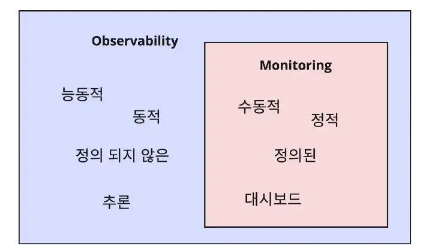

# Monitoring의 현재와 미래, 그리고 Observability

- 노션 페이지 생성일: 2022.12.28

 

### Main blog URL:

[Monitoring의 현재와 미래, 그리고 Observability](https://blog.cloudacode.com/monitoring%EC%9D%98-%ED%98%84%EC%9E%AC%EC%99%80-%EB%AF%B8%EB%9E%98-%EA%B7%B8%EB%A6%AC%EA%B3%A0-observability-ab7babbc6d28)

## 개요:

요즘의 애플리케이션

- 비즈니스 로직이 복잡
- 연동되는 솔루션이 많아짐

좋은 monitoring 및 observability 스택의 중요성이 높아지고 있음

## Observability (관측 가능성)

> 기존 모니터링으로 감지하는 메트릭과 로그 같은 사전 정의 항목뿐만 아니라 정의할 수 없는 여러 가지 항목 및 패턴 그리고 변경된 형상을 추적, 교정하는 방법을 제시해주는 기술 혹은 방법의 집합
> 

### 궁극적인 목표: 모든 구성원이 시스템에 대한 가시성을 확보하는 것

- 기존의 모니터링이 가진 개념에서 확장된 개념