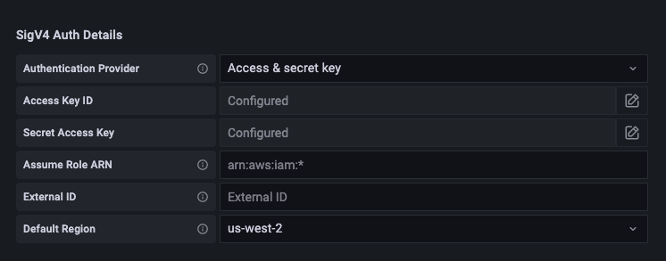

# [공식사용자가이드]Amazon Managed Service for Prometheus

- 노션 페이지 생성일: 2022.12.27
- 깃헙 업로드 및 수정일: 2022.01.02 (내용 추가 및 수정 진행중)


<br>

## Main docs URL:[Amazon Managed Service for Prometheus Documentation](https://docs.aws.amazon.com/prometheus/?icmpid=docs_homepage_mgmtgov)

<br>

## User guide URL:

[What is Amazon Managed Service for Prometheus?](https://docs.aws.amazon.com/prometheus/latest/userguide/what-is-Amazon-Managed-Service-Prometheus.html)

- [공식 소개 페이지 글](https://github.com/sainthm/NDREAM/tree/main/Prometheus/AWS/Official_Introduction)과 겹치는 내용은 생략

<br>

## Supported Regions:

- US East (Ohio)
- US East (N. Virginia)
- US West (Oregon)
- Asia Pacific (Singapore)
- Asia Pacific (Sydney)
- Asia Pacific (Tokyo)
- Europe (Frankfurt)
- Europe (Ireland)
- Europe (London)
- Europe (Stockholm)

<br>

### Pricing:

- Ingestion and storage of metrics
- Storage charge (Based on the compressed size of metric samples and metadata)

[Amazon Managed Service for Prometheus Pricing | Fully Managed Prometheus | Amazon Web Services](https://aws.amazon.com/ko/prometheus/pricing/)

<br>

# Getting started:

### 기본 작업:

- 계정 생성
- IAM 사용자 및 key 생성

<br>

## 프로메테우스 작업:

### 개요:

- Workspace 생성
- Workspace에 프로메테우스 메트릭 ingest
- 프로메테우스 메트릭 query

<br>

## Create a workspace:

### Workspace:

- A workspace is a logical space dedicated to the storage and querying of Prometheus metrics.


<br>

### AWS CLI를 활용한 설치 방법

```python
# Workspace alias 설정
# Alias가 유니크할 필요는 X
# 내부적으로 고유의 workspace ID를 부여받음

# Workspace 생성 명령어
aws amp create-workspace [ --alias my-first-workspace]

# Workspace 상태 확인 명령어
aws amp describe-workspace --workspace-id my-workspace-id
```

<br>

## Ingest Prometheus metrics to the workspace:

### Remote write:

Ingesting metrics is done using Prometheus remote write. 

Remote write enables the sending of samples to a remote storage destination.

[Configuration | Prometheus](https://prometheus.io/docs/prometheus/latest/configuration/configuration/#remote_write)


<br>

### Secure the ingestion of your metrics

- Using AWS PrivateLink with Amazon Managed Service for Prometheus
    - Public internet endpoint
    - VPC endpoint through AWS PrivateLink
        
        [Using Amazon Managed Service for Prometheus with interface VPC endpoints](https://docs.aws.amazon.com/prometheus/latest/userguide/AMP-and-interface-VPC.html)
        
- Authentication and authorization
    - IAM roles (Prometheus server, Grafana server)
    - AWS Signature Version 4 (AWS SigV4)
        
        [Signing AWS API requests](https://docs.aws.amazon.com/general/latest/gr/signature-version-4.html)
        

<br>

### **Ingestion methods and how to set them up**

- Ingest metrics from a Prometheus server
- Use AWS Distro for OpenTelemetry

<br>

> 고가용성을 위해, 다수의 프로메테우스 서버(인스턴스)를 생성하여 하나의 AMP workspace로 보낼 경우, deduplication 작업 필요 
> (겹치는 메트릭에 대해서는 중복으로 과금)

<br>

[Send high-availability data with Prometheus or the Prometheus Operator](https://docs.aws.amazon.com/prometheus/latest/userguide/AMP-ingest-dedupe.html)


<br>

## **Quick Start: Set up ingestion from a new Prometheus server using Helm:**

- 시나리오:
    - Amazon EKS cluster 환경
    - default 설정으로 메트릭 전달
    - Helm CLI 3.0 or later

<br>

### Step:

1. Add new Helm chart repo
2. Create a Prometheus namespace
3. Set up IAM roles for service accounts
4. Set up the new server and start ingesting metrics

<br>

```yaml
# yaml 파일

# IAM_PROXY_PROMETHEUS_ROLE_ARN >> 변경 필요
# WORKSPACE_ID >> 변경 필요
# AWS_REGION >> 변경 필요

## The following is a set of default values for prometheus server helm chart which enable remoteWrite to AMP
## For the rest of prometheus helm chart values see: https://github.com/prometheus-community/helm-charts/blob/main/charts/prometheus/values.yaml
##
serviceAccounts:
  server:
    name: amp-iamproxy-ingest-service-account
    annotations: 
      eks.amazonaws.com/role-arn: ${IAM_PROXY_PROMETHEUS_ROLE_ARN}
server:
  remoteWrite:
    - url: https://aps-workspaces.${AWS_REGION}.amazonaws.com/workspaces/${WORKSPACE_ID}/api/v1/remote_write
      sigv4:
        region: ${AWS_REGION}
      queue_config:
        max_samples_per_send: 1000
        max_shards: 200
        capacity: 2500
```

<br>

```bash
# Prometheus server 생성 명령어

# prometheus-chart-name >> Prometheus release name 으로 변경 필요
# prometheus-namespace >> Prometheus namespace 값으로 변경 필요
helm install prometheus-chart-name prometheus-community/prometheus -n prometheusnamespace \
-f my_prometheus_values_yaml
```

<br>

### 유저가이드 내에 있는 모든 실행 예시

- **Set up ingestion from a new Prometheus server using Helm**
- **Set up ingestion from an existing Prometheus server in Kubernetes on EC2**
- **Set up ingestion from an existing Prometheus server in Kubernetes on Fargate**
- **Set up metrics ingestion using AWS Distro for Open Telemetry on an Amazon Elastic Kubernetes Service cluster**
- **Set up metrics ingestion from Amazon ECS using AWS Distro for Open Telemetry**
- **Set up metrics ingestion from an Amazon EC2 instance using remote write**

<br>

### **Send high-availability data with Prometheus or the Prometheus Operator**

- Deduplication 셋팅
- 고가용성을 위한 설정 (+이중과금을 막기 위한 설정)
- 설정 적용 시, AMP는 하나의 인스턴스를 leader replica로 설정하고 데이터 샘플을 해당 레플리카를 통해서만 ingest 함
- Leader replica가 30초 동안 AMP로 데이터 샘플을 보내지 않으면, AMP는 자동으로 다른 프로메테우스 인스턴스를 리더 레플리카로 선정하고 새로운 리더로 부터 데이터를 ingest

<br>

- 설정을 위해서 붙여야하는 라벨명: ```cluster```
- 각각의 레플리카를 그룹에서 구별하기 위해 붙이는 라벨명: ```__replica__```
- De-duplication 작업을 위해서는 위의 두 개의 라벨이 모두 필요: cluster , ```__replica__```


<br>


### **Send high-availability data to Amazon Managed Service for Prometheus with the Prometheus community Helm chart**

- 헬름 차트를 이용한 고가용성 설정 방법
- external_labels 설정을 통해 HA 구성임을 명시적으로 표현 필요
- Multiple replicas 구성을 위해서는 명시적으로 다른 레플리카 값으로 여러번 배포해야함
  - replica 라벨에 대해 auto-set 적용을 위해서는 prometheus-operator Helm chart 활용 필요

<br>

```yaml
server:
  global:
      external_labels:
          cluster: monitoring-cluster
          __replica__: replica-1
```

<br>
<br>

# **Query your Prometheus metrics**

- 메트릭 들이 워크스페이스에 ingest 된 후, 메트릭에 대한 쿼리 가능
    - 그라파나 등을 사용하여 메트릭을 쿼리 가능
    - AMP API 사용 가능
- PromQL을 활용하여 쿼리 가능

[Querying basics | Prometheus](https://prometheus.io/docs/prometheus/latest/querying/basics/)

<br>

### Securing your metric queries

- Public internet endpoint 활용
- AWS PrivateLink 활용

<br>

### Authentication and authorization

- IAM 사용
    - AMP 생성 중 IAM Role 생성 (Grafana server 에서 AMP 워크스페이스 지표 쿼리 허용 관련)
- AWS SigV4 사용

<br>

### **Set up Amazon Managed Grafana for use with Amazon Managed Service for Prometheus**

- AMG 콘솔에서 AMP 워크스페이스를 데이터 소스로 선택 가능
- AMP의 alert 들을 AMG에서 확인 가능

<br>

### ****Connecting to Amazon Managed Grafana in a private VPC****

- AMP는 AMG를 연결하기 위한 서비스 엔드포인트 제공
- Private VPC에서 AMG를 설정 가능
  - 해당 VPC는 AMP 서비스 엔드포인트에 액세스 불가능
  - 이를 해결하기위해서는 specific private VPC 활용 필요
    - AMP를 VPC 엔드포인트(interface endpoint)가 있는 동일한 VPC에 연결
    - [Using Amazon Managed Service for Prometheus with interface VPC endpoints](https://docs.aws.amazon.com/prometheus/latest/userguide/AMP-and-interface-VPC.html#create-VPC-endpoint-for-AMP)


<br>

### Set up Grafana open source or Grafana Enterprise for use with Amazon Managed Service for Prometheus

- 그라파나 7.3.5 버전 및 그 이후 버전 지원

<br>

### ****Set up AWS SigV4****

- 자체 관리 그라파나 or 그라파나 엔터프라이즈 서버를 사용할 경우 아래 절차 진행
- 그라파나 데이터 소스에 대한 SigV4 인증을 통한 AMP 인증 & 인가 capability 강화 가능

<br>

```bash
# Linux
export AWS_SDK_LOAD_CONFIG=true

export GF_AUTH_SIGV4_AUTH_ENABLED=true

cd grafana_install_directory

./bin/grafana-server
```

<br>

```bash
# Windows
set AWS_SDK_LOAD_CONFIG=true

set GF_AUTH_SIGV4_AUTH_ENABLED=true

cd grafana_install_directory

.\bin\grafana-server.exe
```

<br>
<br>

## ****Add the Prometheus data source in Grafana****

[Set up Grafana open source or Grafana Enterprise for use with Amazon Managed Service for Prometheus](https://docs.aws.amazon.com/prometheus/latest/userguide/AMP-onboard-query-standalone-grafana.html#AMP-onboard-query-standalone-grafana-datasource)



<br>


- 설정 예시 이미지
- 설정 완료 후, 아래의 샘플 쿼리 실행 (PromQL)

<br>

```bash
prometheus_tsdb_head_series
```

<br>

### ****Troubleshooting if Save & Test doesn't work****

[Set up Grafana open source or Grafana Enterprise for use with Amazon Managed Service for Prometheus](https://docs.aws.amazon.com/prometheus/latest/userguide/AMP-onboard-query-standalone-grafana.html#AMP-onboard-standalone-grafana-troubleshoot)

### 번외. 프로메테우스와 그라파나 최신 버전 체크

- 프로메테우스


<br>
<br>

- 그라파나


<br>
<br>

## **Query using Grafana running in an Amazon EKS cluster**

- AMP와 그라파나를 연동하기 위해서는 **AmazonPrometheusQueryAccess** 정책이 있는 계정으로 로그인하거나 아래의 권한이 있어야함
    - `aps:QueryMetrics`
    - `aps:GetMetricMetadata`
    - `aps:GetSeries`
    - `aps:GetLabels`

<br>

### ****Set up AWS SigV4****

```yaml
# amp_query_override_values.yaml - grafana 설정 파일에 아래 내용 추가

# annotations 항목 수정 필요
## account-id 수정, 그라파나 서버가 돌고 있는 계정
## amp-iamproxy-query-role 수정

serviceAccount:
    name: "amp-iamproxy-query-service-account"
    annotations:
        eks.amazonaws.com/role-arn: "arn:aws:iam::account-id:role/amp-iamproxy-query-role"
grafana.ini:
  auth:
    sigv4_auth_enabled: true
```

<br>

### ****Set up IAM roles for service accounts****

- Grafana 서버를 EKS 클러스터에서 돌린다면 service account IAM role 사용을 권장 (service role)
    
    [IAM roles for service accounts](https://docs.aws.amazon.com/eks/latest/userguide/iam-roles-for-service-accounts.html)
    
- 쿼리를 위한 service role이 없을 경우, 아래 링크를 참고하여 생성
    
    [Set up IAM roles for service accounts](https://docs.aws.amazon.com/prometheus/latest/userguide/set-up-irsa.html#set-up-irsa-query)
    
- 준비되었다면 grafana service account를 신뢰 관계

<br>

### ****Upgrade the Grafana server using Helm****

- amp_query_override_values.yaml 파일을 이용한 그라파나 서버 업그레이드 관련 내용

```bash
helm repo add grafana https://grafana.github.io/helm-charts
```

```bash
helm upgrade --install grafana grafana/grafana -n grafana_namespace -f ./amp_query_override_values.yaml
```

<br>

### **Add the Prometheus data source in Grafana**

1. 그라파나 콘솔 오픈
2. Configurations -> Data sources 선택
3. Add data source 선택
4. Prometheus 선택
5. HTTP URL을 위하여, Endpoint - query URL 선택
6. HTTP URL 항목에서 /api/v1/query 부분 삭제 (프로메테우스가 자동으로 갱신)
7. Auth 항목에서 SigV4 Auth 활성화
8. Save & Test 선택
9. 새로운 데이터 소스에 대해, PromQL로 쿼리 테스트 진행
- Explore 선택
- 아래의 샘플 PromQL 쿼리 실행

  ```bash
  prometheus_tsdb_head_series
  ```

<br>

## Query using Prometheus-compatible APIs
[Prometheus-compatible APIs](https://docs.aws.amazon.com/prometheus/latest/userguide/AMP-APIReference.html#AMP-APIReference-Prometheus-Compatible-Apis)

<br>

### Using awscurl to query Prometheus-compatible APIs

<br>


## Query stats information in query API response

[Amazon Managed Service for Prometheus pricing](https://aws.amazon.com/ko/prometheus/pricing/)

- 한 달 동안 실행된 쿼리 샘플의 총 수로 쿼리 비용 발생


<br>

