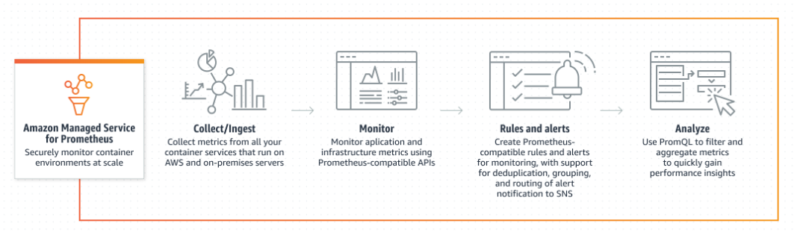

# [공식소개페이지]Amazon Managed Service for Prometheus

- 노션 페이지 생성일: 2022.12.26

<br>


**Main URL:**  [오픈 소스 모니터링 - Amazon Managed Service for Prometheus - Amazon Web Services](https://aws.amazon.com/ko/prometheus/)

<br>
<br>

## 컨테이너식 시스템을 위한 안전한 고가용성 관리형 모니터링

### 특징:

- Prometheus 쿼리 언어(PromQL) 사용
- Self-managed k8s 클러스터 관리 가능 (고유 시계열 지표)
  - Filter
  - Aggregate
  - Ingest
- Automatically scale
- Maintain consistent response times for large container deployments
- AWS 보안 서비스와 통합
- Standalone Prometheus 서버에 대한 운영 비용 절감
  - Configuring
  - Upgrading
  - Scaling

<br>

<br>

### 작동방식:



- 통합 AWS 서비스: EKS, ECS, AWS Distro for Open Telemetry

<br>
<br>

### Use cases:

- Unified system monitoring: AWS 및 하이브리드 환경에 대해 컨테이너 모니터링 가능
- TS & RCA
- High-cardinality metrics monitoring

```
# What is mean high-cardinality

In data analysis and statistics, high-cardinality refers to a situation in which a categorical variable has a large number of possible values or categories. This can occur when the variable is not ordinal, meaning that there is no inherent ranking or order to the categories. For example, if you have a dataset with a categorical variable that represents the name of every person in the world, that variable would have very high cardinality, because it has a very large number of possible values (names).

High-cardinality variables can be challenging to work with in data analysis, because they can produce sparse data matrices, which can make it difficult to detect patterns or trends. In addition, they can be computationally intensive to work with, because they may require more memory or processing power. To deal with high-cardinality variables, data scientists may need to use specialized techniques, such as dimensionality reduction or aggregating the data in some way.
```

<br>
<br>

## FAQs

- Serverless monitoring service
- Powered by Cortex
- 대상:
  - Amazon Elastic Kubernetes Service
  - Amazon Elastic Container Service
  - AWS Fargate (as well as)
  - Self-managed Kubernetes clusters
- 고가용성과 멀티존 배포, 통합 보안 제공
- PromQL 지원
- AWS 관리 파트:
  - (일부) 보안
  - Scalability
  - Availability
- Handle the high cardinality (large number of arbitrary tags)
- CNCF-hosted 프로젝트와 100% compatible 제공
- Seamlessly integrates with the Amazon Managed Grafana
  - Data visualization
  - Team management authentication
  - Authorization